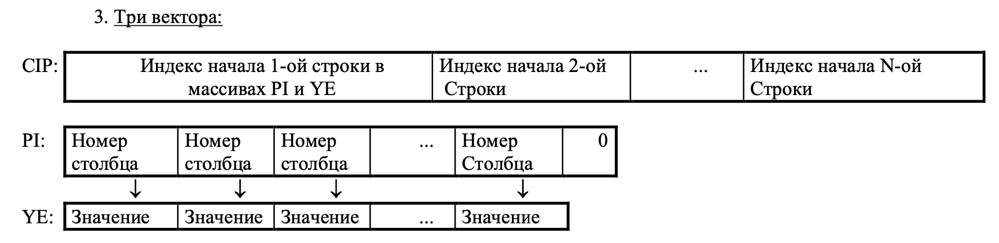

 # Отчёт по курсовой работе №7 по курсу “Фундаментальная информатика”

Студент группы: М80-108Б-22 Горюнов Даниил Владимирович, № по списку 4 

Контакты e-mail: dania.goryunow2013@yandex.ru

Работа выполнена: «2» июня 2023г.

Преподаватель: асп. каф. 806 Сахарин Никита Александрович

Входной контроль знаний с оценкой _______________________

Отчет сдан «2» июня 2023 г., итоговая оценка ______

Подпись преподавателя ___________


## 1. Тема
Разреженные матрицы
## 2. Цель работы
Составить программу на языке Си с процедурами и/или функциями для обработки прямоугольных разреженных матриц с
элементами целого (группы 6, 8), вещественного (группы 2-5), или комплексного (группы 1, 7) типов, которая:
1. вводит матрицы различного размера, представленные во входном текстовом файле в обычном формате (по строкам),
с одновременным размещением ненулевых элементов в разреженной матрице в соответствии с заданной схемой;
2. печатает введенные матрицы во внутреннем представлении согласно заданной схеме размещения и в обычном
(естественном) виде;
3. выполняет необходимые преобразования разреженных матриц (или вычисления над ними) путем обращения к
соответствующим процедурам и/или функциям;
4. печатает результат преобразования (вычисления) согласно заданной схеме размещения и в обычном виде.
## 3. Задание
Реализовать хранение разряженной матрицы на 3 векторах

**Действие**

Определить максимальный по модулю элемент матрицы и разделить на него все элементы столбца, в котором он находится. Если таких элементов несколько, обработать предпоследний столбец, содержащий такой элемент.

## 4. Оборудование:
Процессор: Apple M1

ОП: 8192 МБ

НМД: 512 ГБ  

Монитор: Retina c диагональю 13,3 дюйма разрешение 2560×1600 пикселей (227 пикселей)
## 5. Программное обеспечение:
Операционная система семейства: MacOS

Система программирования: VS code
## 6. Идея, метод, алгоритм решения задачи (в формах: словесной, псевдокода, графической [блок-схема, диаграмма, рисунок, таблица] или формальные спецификации с пред- и постусловиями)

## 7. Сценарий выполнения работы [план работы, первоначальный текст программы в черновике (можно на отдельном листе) и тесты либо соображения по тестированию]. 
```c:/Course_projects/Course_project_7/main.c
#include <stdio.h>
#include <ctype.h>
#include "headers/dbl_vec.h"

typedef struct {
    dbl_vec* CIP;   // idx of first el in PI and YE
    dbl_vec* PI;    // numbers of column
    dbl_vec* YE;    // numbers
    int width;  // number of columns
    int lines; 
} matrix;

void input_matr(matrix* m){
    m->width = 0;
    m->lines = 0;
    int c = getchar();
    int num = 0, column = 0, not_zeros = 0;
    bool is_negative = false;
    while (c != EOF){
        if (c == ' '){
            if (num != 0){
                if (is_negative) {
                    num *= -1;
                }
                push_back(m->YE, num);
                push_back(m->PI, column);
                not_zeros++;
            }
            // как-то надо определить первый элекмент в линии: длина всего вектора PI - количество элементов в текущей строке
            column++;
            num = 0;
            is_negative = false;
        } else if (c == '\n' || c == EOF) {
            if (num != 0){
                if (is_negative) {
                    num *= -1;
                }
                push_back(m->YE, num);
                push_back(m->PI, column);
                not_zeros++;
            }
            push_back(m->CIP, get_size(m->PI) - not_zeros);
            not_zeros = 0;
            column++;
            if (column > m->width) {
                m->width = column;
            }
            column = 0;
            num = 0;
            is_negative = false;
            m->lines++;
        } else if (c == '-') {
            is_negative = true;
        } else if (!isdigit(c)){
            fprintf(stderr, "Not number was inputed!\n");
            m->width = -1;
            return;
        } else {
            num *= 10;
            num += c - '0';
        }
        c = getchar();
    }
}

void print_zeros(int n){
    if (n == 0){
        return;
    }
    for (int i = 0; i < n; i++){
        printf("0 ");
    }
}

void print_matr(matrix m){
    int idx_line = 0, column = 0;
    for (int i = 0; i < get_size(m.PI); i++){
        // printf("    DEBUG: i = %d  idx_line = %d    ", i, idx_line);
        if (i == get_el(m.CIP, idx_line)){
            if (column != m.width && i != 0){
                print_zeros(m.width - column);
            }
            printf("\n");
            idx_line++;
            if (get_el(m.CIP, idx_line - 1) == get_el(m.CIP, idx_line)) {
                print_zeros(m.width);
                printf("\n");
                idx_line++;
            }
            column = 0;
        } 
        if (get_el(m.PI, i) > column) {
            print_zeros(get_el(m.PI, i) - column);
            column = get_el(m.PI, i);
        }
        printf("%d ", get_el(m.YE, i));
        column++;
    }
    print_zeros(m.width - column);
    printf("\n");
    for (int i = 0; i < m.lines - idx_line; i++) {
        print_zeros(m.width);
        printf("\n");
    }
    printf("\n");
    // printf("width: %d\n", width);
}

int abs(int a) {
    if (a < 0) {
        return -a;
    }
    return a;
}

// return el's idx in PI or YE
int abs_max(matrix m) {
    int max = 0, idx_max, preidx_max;
    bool is_same_exist = false;
    for (int i = 0; i < get_size(m.YE); i++) {
        if (abs(get_el(m.YE, i)) > max) {
            max = abs(get_el(m.YE, i));
            idx_max = i;
            is_same_exist = false;
        } else if (abs(get_el(m.YE, i)) == max) {
            if (get_el(m.PI, i) > get_el(m.PI, idx_max)) {
                preidx_max = idx_max;
            } else {
                preidx_max = i;
            }
            idx_max = i;
            is_same_exist = true;
        }
    }
    if (is_same_exist) {
        return preidx_max;
    }
    return idx_max;
}

void divide_column(matrix m, int column, int val) {
    for (int i = 0; i < get_size(m.PI); i++) {
        if (get_el(m.PI, i) == column) {
            set_el(m.YE, i, get_el(m.YE, i) / val);
        }
    }
}


int main(){
    matrix m;
    dbl_vec CIP = init();
    dbl_vec PI = init();
    dbl_vec YE = init();
    m.CIP = &CIP;
    m.PI = &PI;
    m.YE = &YE;
    input_matr(&m);
    if (m.width == -1){
        return 1;
    }
    printf("CIP:\n");
    for (int i = 0; i < get_size(m.CIP); i++){
        printf("%d\n", get_el(&CIP, i));
    }
    printf("PI:\n");
    for (int i = 0; i < get_size(m.PI); i++){
        printf("%d\n", get_el(&PI, i));
    }
    printf("YE:\n");
    for (int i = 0; i < get_size(m.YE); i++){
        printf("%d\n", get_el(&YE, i));
    }

    printf("Matrix:\n");
    print_matr(m);
    printf("\n");
    int idx_max = abs_max(m);
    int max_column = get_el(m.PI, idx_max);
    divide_column(m, max_column, get_el(m.YE, idx_max));
    printf("Divided matrix:\n");
    print_matr(m);
    
    destroy(m.CIP);
    destroy(m.PI);
    destroy(m.YE);

    return 0;
}

```
Пункты 1-7 отчета составляются сторого до начала лабораторной работы.
Допущен к выполнению работы.  
Подпись преподавателя _____________________
## 8. Распечатка протокола 
```
admin@MacBook-Pro-2 Course_project_6 % clang -std=c99 -pedantic -Wall kp6_1.c 
admin@MacBook-Pro-2 Course_project_6 % ./a.out database.txt bin.bin           
26 lines are written
admin@MacBook-Pro-2 Course_project_6 % clang -std=c99 -pedantic -Wall kp6_2.c 
admin@MacBook-Pro-2 Course_project_6 % ./a.out bin.bin -p 3 3                 
Dautov
Zhdanov
Zhuravlyov
Ivanov
Karimov
Kolomytseva
Larin
Medvedev
Nosov
Postnov
Saraykin
Sviridov
Sedov
Filatov
```
## 9. Дневник отладки должен содержать дату и время сеансов отладки и основные события (ошибки в сценарии и программе, нестандартные ситуации) и краткие комментарии к ним. В дневнике отладки приводятся сведения об использовании других ЭВМ, существенном участии преподавателя и других лиц в написании и отладке программы.

| № |  Лаб. или дом. | Дата | Время | Событие | Действие по исправлению | Примечание |
| ------ | ------ | ------ | ------ | ------ | ------ | ------ |
| 1 | дом. | 02.06.23 | 18:00 | Башня | - | - |
## 10. Замечания автора по существу работы — Написание команд для отработки навыков работы в ОС UNIX.
[Контест](https://codeforces.com/contest/1814/submission/201016894)

[Дорешка](https://codeforces.com/contest/1814/submission/202877281)
## 11. Выводы
После выполнения работы, были получены навыки хранения разряженных матриц и работы с ними.
Недочёты при выполнении задания могут быть устранены следующим образом: —

Подпись студента _________________